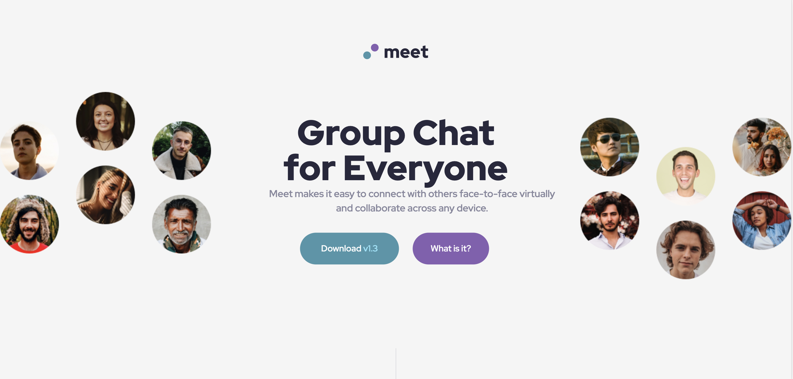

# Frontend Mentor - Meet landing page solution

This is a solution to the [Meet landing page challenge on Frontend Mentor](https://www.frontendmentor.io/challenges/meet-landing-page-rbTDS6OUR). Frontend Mentor challenges help you improve your coding skills by building realistic projects. 

## Table of contents

- [Overview](#overview)
  - [The challenge](#the-challenge)
  - [Screenshot](#screenshot)
  - [Links](#links)
- [My process](#my-process)
  - [Built with](#built-with)
  - [What I learned](#what-i-learned)
- [Author](#author)

**Note: Delete this note and update the table of contents based on what sections you keep.**

## Overview

### The challenge

Users should be able to:

- View the optimal layout depending on their device's screen size
- See hover states for interactive elements

### Screenshot

### Links

- Solution URL: [Add solution URL here](https://github.com/aavv8931/Meet-Landing-Page)
- Live Site URL: [Add live site URL here](https://meet-landing-page-seven.vercel.app/)

## My process

### Built with

- Semantic HTML5 markup
- CSS custom properties
- Flexbox
- Bootstrap v5
- CSS Grid
- Mobile-first workflow

### What I learned

In this project I learned how to implement Bootstrap layout. I have seen that is quite easy to use and how adptive it is. 

## Author

- Frontend Mentor - [@aavv8931](https://www.frontendmentor.io/profile/aavv8931)
- Twitter - [@aavv89](https://twitter.com/aavv89)

